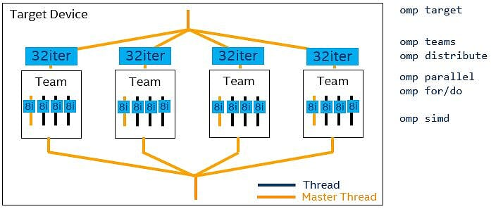

# Repositorio para las prácticas de la asignatura de CAP

## Práctica 1 (Explotación paralelismo vectorial)
* Pequeños vectores = SIMD  (Single Instruction Multiple Data)


* Las instrucciones y códigos del [laboratorio 1](src/lab1/lab1.md)


## Práctica 2 (Explotación paralelismo OpenMP)
* Aplicación secuencial en sistema con varios cores


* Las instrucciones y códigos del [laboratorio 2](src/lab2/lab2.md)


## Práctica 4 (Explotación paralelismo heterogéneo con OpenMP)
* Explotación de paralelismo heterogéneo tipo CPU-GPU mediante el paradigma de programación de OpenMP



* Las instrucciones y códigos del [laboratorio 4](src/lab4/lab4.md) donde se abordarán ejemplos de:
    * Primeros casos de uso de la pragma ``target```
    * Recomendaciones de programación para explotar todos los niveles de paralelismo en una GPU de Intel (Slice, Subslice, EUs, SIMD) o en una de NVIDIA (GPU Processing Clusters-GPCs, Texture Processing Clusters-TPCs, Stream Multiprocessors-SMs, CUDA-cores...)
    * Minimización de transferencias por PCIe
    * Uso de herramientas de perfilado de Intel como [Intel-Advisor](https://www.intel.com/content/www/us/en/develop/documentation/advisor-user-guide/top/analyze-gpu-roofline.html) e [Intel-VTune](https://www.intel.com/content/www/us/en/develop/documentation/vtune-help/top/analyze-performance/accelerators-group/gpu-offload-analysis.html)
