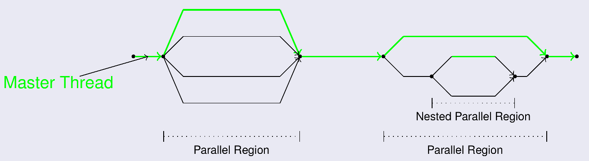
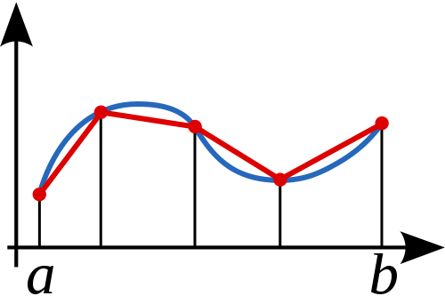
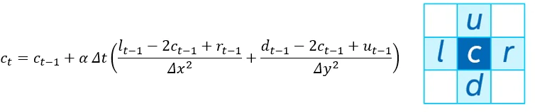
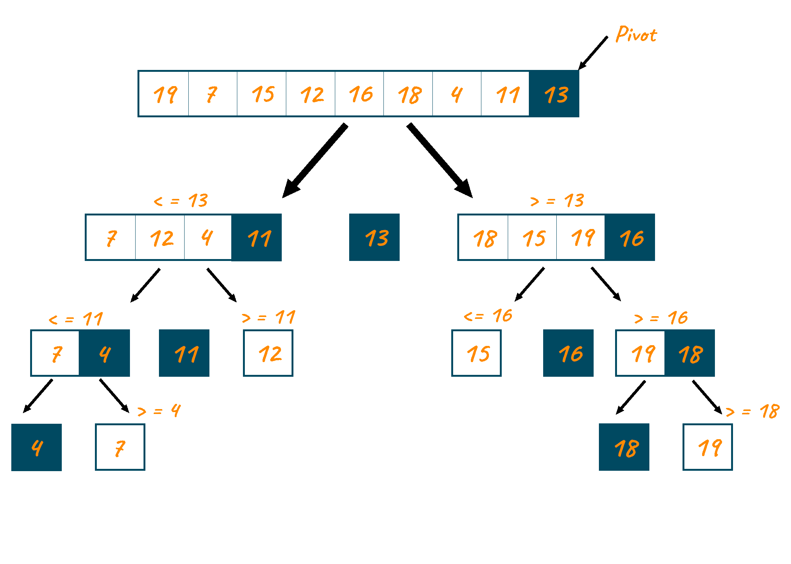
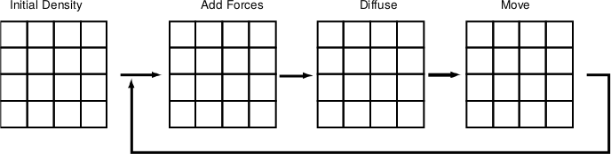
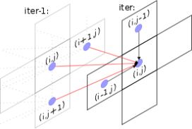
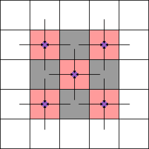
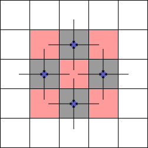

# Práctica 2

## OpenMP
* OpenMP explota el **paralelismo mediante hilos/threads**
* Un hilo es entidad más pequeña de procesamiento
    * Más liviano que un proceso
* Habitualmente, un número de hilos se pueden mapear sobre una máquina multiprocesador/core

### Paralelismo explícito
* OpenMP es un paradigma de programación explícito (no automático)
* Expresado mediante **directivas**
* Utiliza modelo **fork-join**
    * El hilo *master* crea un conjunto de hilos que acaban al finalizar la región paralela
    * Los hilos pueden colaborar



### Soporte compilador
* En [Toolkit oneAPI HPC](https://www.intel.com/content/www/us/en/developer/tools/oneapi/hpc-toolkit.html) están disponibles los compiladores de C/C++ con soporte para OpenMP
    * Compilador clásico: icc/icpc
    * Compilador oneAPI DPC++/C++: icx/icpx

* Las pragmas OpenMP indican al compilador las regiones paralelas, y se compilan con la opción de compilador **-qopenmp**

### Hello World
* El [primer ejemplo](HelloWorld/hello.c) versará sobre la compilación y control de hilos de ejecución

```c
#include <stdio.h>
#include <omp.h>

int main(){

	// This code is executed by 1 thread
	printf("OpenMP with %d max threads\n", omp_get_max_threads () );
	printf("OpenMP with %d procs available\n", omp_get_num_procs () );

	#pragma omp parallel
	{
	// This code is executed in parallel
	// by multiple threads
	printf("Hello World from thread %d of %d threads\n",
		omp_get_thread_num(), omp_get_num_threads() );
	}
}
```
* Pudiendo compilar con ambos compiladores y generando el fichero de reportes

```sh
user@lab:~ $ icc -o hello.icc hello.c -qopenmp -qopt-report
user@lab:~ $ more hello.optrpt 

...
Begin optimization report for: main()

    Report from: OpenMP optimizations [openmp]

OpenMP Construct at hello.c(12,2)
remark #16201: OpenMP DEFINED REGION WAS PARALLELIZED
```

* Para controlar el número de hilos de ejecución se puede hacer de varias formas:
    * Con la variable de entorno *OMP_NUM_THREADS*
    * En la pragma ```#pragma omp parallel num_threads(3)```

```sh
user@lab:~ $ export OMP_NUM_THREADS=3
user@lab:~ $ ./hello.icc
OpenMP with 3 max threads
OpenMP with 4 procs available
Hello World from thread 0 of 3 threads
Hello World from thread 1 of 3 threads
Hello World from thread 2 of 3 threads
```

### Directivas de trabajo compartido
* En OpenMP existen varias formas de explicitar la distribución del trabajo entre los hilos
    * ```#pragma omp for/#pragma omp parallel for``` para distribuir las iteraciones de los bucles entre los hilos disponibles
    * ```#pragma omp sections``` para crear secciones de código concurrente entre hilos
    * ```#pragma omp single``` para expresar una región secuencial dentro de una región paralela
* En este [segundo ejemplo](TrabajoCompartido/prime.c) trabajaremos dos aspectos:
    * Distribución de trabajo entre hilos
    * Gestión de variables (privadas, compartidas...)

* El ejemplo ["prime.c"](TrabajoCompartido/prime.c)  calcula los números primos menores a un determinado **n** (parámetro de entrada)
    * **i** es primo si no tiene divisores $(2,i/2)$
    * ```#define DEBUG``` visualiza la lista de primos

```c
	//#pragma omp parallel...
	for (i=2; i<n; i++)
	{
		not_flag = 0;
		j=2;
		while(j<=i/2 && !not_flag)
		{
			if(i%j==0) // not prime
				not_flag=1;
			j++;
		}
		if (j>=i/2 && !not_flag)
			primes[++k] = i;
	}
```

#### Expresión de parelismo
* Iteraciones del bucle **i** potencialmente paralelas
    * Iteraciones independientes
* A tener en cuenta
    * Uso de variables: privadas, compartidas.... ect
    * Variable ```++k``` es el índice de la lista de números primos
        * Posible carrera: problema **read\&update\&write**
        * Solución: ```#omp critical```
        * Lista desordenada: implementar un *sort(primes)*

* **A Evaluar** Se recomienda estudiar el impacto de las diferentes políticas de distribución de carga 
    * *STATIC*
    * *STATIC, chunk*
    * *DYNAMIC[, chunk]*
    * *GUIDED[, chunk]*
    * *AUTO*

### Condiciones de Carrera
*  El [tercer ejemplo](CondicionesCarrera/trapezoidal.c) cálculo la integral mediante el método del trapecio de acuerdo a la siguiente ecuación
    * Area del trapecio $S=\frac{1}{2}(f(a')+f(b'))*h$
    * Integral como suma de trapecios: $\int_{a}^{b} f(x) \partial x = \sum \frac{f(a')+f(b')}{2}h$



* Podemos destacar **dos tipos tareas**:
    * Cálculo de areas de cada trapecio individual
    * Acumulación de trapecios (*integral*) donde potencialmente pueden aparecer condiciones de carrera


```c
double Trap(double a, double b, int n, double h) {
	double integral, area;
	int k;

	integral = 0.0;
	for (k = 1; k <= n; k++) {
		area = h*(f(a+k*h)+f(a+(k-1)*h))/2.0;
		integral+=area;
	}

	return integral;
}  /* Trap */
```
### Tareas OMP
* El [cuarto ejemplo](Tareas/fibo_task.c) pone en valor la explotación del paralelismo mediante tareas haciendo uso del algoritmo de Fibonacci
    * Tareas OMP = unidades de trabajo (ejecución puede diferirse)
    * Las tareas se componen de:
        * código para ejecutar y datos
    * Hilos pueden **cooperar** para ejecutarlas
 

```c
long comp_fib_numbers(int n)
{
	long fnm1, fnm2, fn;
	if ( n == 0 || n == 1 ) return(1);
	if ( n<20 ) return(comp_fib_numbers(n-1) +comp_fib_numbers(n-2));

	#pragma omp task...
	{fnm1 = comp_fib_numbers(n-1);}
	#pragma omp task...
	{fnm2 = comp_fib_numbers(n-2);}
	#pragma omp...
	fn = fnm1 + fnm2;

	return(fn);
}


int main(int argc, char* argv[]) {
	....
#pragma omp parallel
{
	#pragma omp single 
	fibo = comp_fib_numbers(n);
}
	...
}  /* main */
```

#### A tener en cuenta
* Posible carrera: problema **read\&update\&write** en la variable *integral*
    * Estudiar las diferentes alternativas:
        * Uso de ```atomic```, ```critical```
        * Expresión de paralelismo con ```#pragma omp for``` pero usando la claúsula **reduction**

```c
	#pragma omp parallel private(...) firstprivate(...) shared(integral)
	{
	id   = ...
	nths = ...
	n_per_thread = n/nths;

	k_init_thread = ...
	k_end_thread  = ...

	integral = 0.0;
	for (k = k_init_thread; k <= k_end_thread; k++) {
		area = h*(f(a+k*h)+f(a+(k-1)*h))/2.0;
		integral_thread+=area;
	}

	#pragma omp critical
	{integral += integral_thread;}

	}

	return integral;
```


# Tareas a realizar por el alumno
* Las tareas a entregar por el alumno corresponde a la implementación paralela mediante el paradigma de programación de OpenMP sobre de tres algoritmos:
    1. Heat2D
    2. Quick-sort
    3. Real Fluid Dynamics For Games

Estos algoritmos se detallan a continuación a la par que las propuesta de optimización/paralelización con OpenMP

## Heat2D
* La ecuación del calor es un problema comúnmente utilizado en los tutoriales de computación paralela
    * Consiste en la resolución de un [sistema de ecuaciones aplicando el concepto de discretización](https://en.wikipedia.org/wiki/Heat_equation)
        * Los métodos de discretización más comunes son de primer grado de Euler
    * Utilizado en computación paralela por el número elevado de celdas que hay que "resolver" simultáneamente
    * Código [extraido](https://repository.prace-ri.eu/git/CodeVault/training-material/parallel-programming/MPI/-/tree/master/heat-equation) del Advanced Computing in Europe (PRACE)
* El [código](Heat2D/) implementa la ecuación del calor discretiza para punto con stencil mediante el stecil de 5



```c
void step(int source_x, int source_y, float *current, float *next)
{
...
  for (unsigned int y = 1; y < N-1; ++y) {
        for (unsigned int x = 1; x < N-1; ++x) {
            next[y*N+x] = current[y*N+x] + a * dt *
				((current[y*N+x+1]   - 2.0*current[y*N+x] + current[y*N+x-1])/dx2 +
				 (current[(y+1)*N+x] - 2.0*current[y*N+x] + current[(y-1)*N+x])/dy2);
...
}

void main()
{
	...
	for (unsigned int it = 0; (it < MAX_ITERATIONS) && (t_diff > MIN_DELTA); ++it) {
		step(source_x, source_y, current, next);
		t_diff = diff(current, next);
		if(it%(MAX_ITERATIONS/10)==0){
			printf("%u: %f\n", it, t_diff);
		}

		float * swap = current;
		current = next;
		next = swap;
	}
...
}
```

#### Tareas a considerar
* Paralelizar el código **heat2d** con el paradigma OpenMP
     * Prestar especial atención a la función *step* y *diff*
     * Se recomienda utilizar la herramienta [Intel vTune](https://www.intel.com/content/www/us/en/develop/documentation/vtune-cookbook/top.html) para encontrar los cuellos de botella y evaluar la escalabilidad de la paralelización OpenMP
     * No olvides que puedes combinar paralelismo del tipo SIMD con paralelismo multi-hilos en los cores (ambos soportados por OpenMP)

## Quick-sort
* Algoritmo de ordenación basado en el concepto divide y vencerás
    1. Elegir un elemento al que llamaremos pivote.
    2. Mover los demás elementos de la lista a cada lado del pivote
        * La lista inicial está separada en dos sublistas: con elementos menores y mayores al pivote
    3. Repetir el proceso de forma recursiva para cada sublista



El [código de la carpeta "Quicksort](Quicksort) hace una llamada a la función ```quickSort``` que calcula la posición del pivote (invocación a ```partition```) lo que permite realizar llamadas recursivas a ```quickSort``` para cada una de las sublistas 

```c
void quickSort(int arr[], int low, int high){
	if(low < high){
		int pivot = arr[high];
		int pos = partition(arr, low, high, pivot);
		
		quickSort(arr, low, pos-1);
		quickSort(arr, pos+1, high);
	}
}
```

#### Tareas a considerar
1. Crear una región paralela que se invoca con un hilo ```single``` a la hora de invocar la primera vez  la función ```quickSort```
2. Explotar paralelismo de tareas en las sucesivas llamadas a la función ```quickSort``` para cada sublista

## Real Fluid Dynamics For Games
* Implementación de dinámica de fluidos como resolutor de ecuaciones para [motores de juegos](https://www.youtube.com/watch?v=UM3VFnHBiOU)
* Extraido del [repositorio](https://github.com/CFusion-zz/Real-Time-Fluid-Dynamics-for-Games/tree/master/code)

### Ecuaciones
* $\frac{\delta u}{\delta t} = -(u \cdot  \nabla)u+\nu \nabla^2u+f$

* $\frac{\delta \rho}{\delta t} = -(u \cdot \nabla)\rho+ \kappa \nabla^2 \rho+S$

* Donde $u$ corresponde a la velocidad y $\rho$ al movimiento de la densidad repecto a la velocidad


Matemáticamente, el estado de un fluido en un instante de tiempo determinado se modela como un vector de velocidad: una función que asigna un vector de velocidad a cada punto del espacio
    * Ej: aire de radiador en una habitación, ciculará ascendentemente debido al aumento de calor 
El campo velocidad no es visualmente interesante hasta que se produce movimiento de objetos: como particulas de humo, polvo o las hojas

* El modelo se basa en el fluido que recorre una caja, por lo que se modelará como un espacio mediante diferencias finitas
    * ```u[size], v[size], u_prev[size], v_prev[size]``` representan las velocidades en una malla de tamaño ```size=(N+2)*(N+2)```
    * ```dens[size], dens_prev[size]``` corresponde a la densidad del fluido
    * Acceso a las cordenadas se realiza con macro ```#define IX(i,j) ((i)+(N+2)*j)```



## Navier-Stokes
* Exiten dos ejecutables: **demo** y **headless**
    * **demo** es simulación gráfica (*botón derecho del ratón* añade densidad, *izquierdo* velocidad al fluido, *v* muestra velocidades y *c* inicializa simulación)
    * **headless** realiza 2048 iteraciones 


#### Tareas a considerar
* Vectorización (recordad bucles independientes, accesos alineados, accesos consecutivos...)
* Paralelización: conveniente en bucles externos
* Función ```lin_solve``` del fichero *solver.c* resuelve las ecuaciones aplicando el método numérico Gauss-Seidel
(más complicado su paralelización)
    * Conviene resolverlo aplicando el método Jacobi (paralelización evidente) o en su defecto un red-black

##### Método de Gauss-Seidel
* Presenta dependencias a media que se procesa la resolución de la malla



##### Método Red-Black
* En un stencil 5, la dependiencias de datos están entre celdas vecinas
    * Si se procesan primero las rojas y luego las negras (damero ajedrez), se pueden procesar todas la rojas simultáneamente




