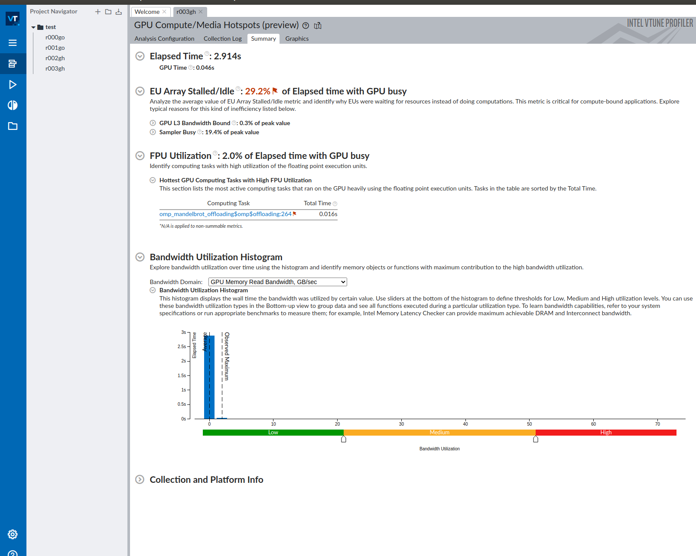
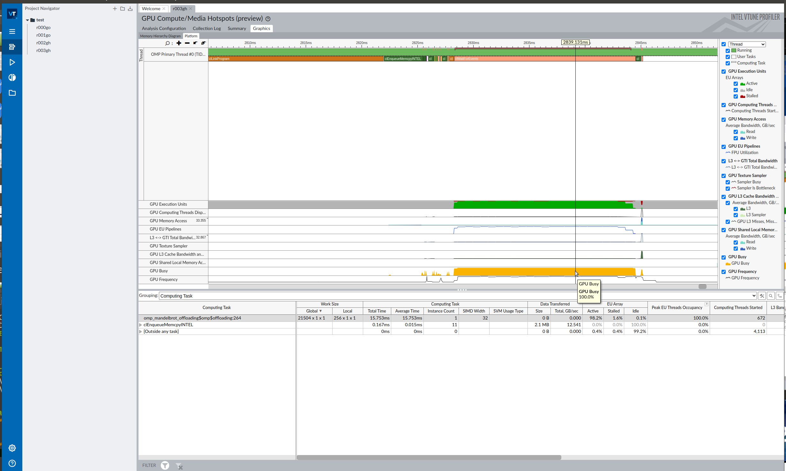

# Objetivos
## Objetivos
* Familiarizarse con la programación por medio de directivas con OpenMP
* Evaluar las mejoras/speedup

# Recursos
## Recursos disponibles
* Recordad la información de la asignatura disponible en el Campus Virtual. [Modulo 6: Computación heterogénea](https://cvmdp.ucm.es/moodle/course/view.php?id=40889#section-7)

* Cuadernos de Jupyter disponibles para ser ejecutados en el [Intel-DevCloud](https://devcloud.intel.com/oneapi/get_started/)
    * Introducción a [OpenMP Offload](https://github.com/oneapi-src/oneAPI-samples/blob/master/DirectProgramming/C%2B%2B/Jupyter/OpenMP-offload-training/intro)
    * Gestión y [manejo de datos](https://github.com/oneapi-src/oneAPI-samples/blob/master/DirectProgramming/C%2B%2B/Jupyter/OpenMP-offload-training/datatransfer) con OpenMP-target
    * Expresión y [explotación de los niveles de paralelismo en GPU](https://github.com/oneapi-src/oneAPI-samples/blob/master/DirectProgramming/C%2B%2B/Jupyter/OpenMP-offload-training/parallelism)
    * Memoria compartida unificada o [USM](https://github.com/oneapi-src/oneAPI-samples/blob/master/DirectProgramming/C%2B%2B/Jupyter/OpenMP-offload-training/USM)


# Entorno
## OpenMP
* Soportado en la Intel® oneAPI HPC Toolkit
* Uso del compilador ICX con soporte OpenMP offloading
    * Conocer las características de la GPU para poder compilar adecuadamente 
    * Activación de OpenMP 4.5 con el flag ```-fiopenmp``` que a su vez tiene soporte **offloading** con el flag ```-fopenmp-targets=spir64```
    * JIT compilation

```bash
user@system:~$ icx -fiopenmp -fopenmp-targets=spir64 source.c
user@system:~$ ifx -fiopenmp -fopenmp-targets=spir64 source.f90
```

## OpenMP (NVIDIA)
* Soportado en la gráficas de [NVIDIA con el SDK](https://docs.nvidia.com/hpc-sdk//index.html)
* Uso del compilador NVC++ con soporte OpenMP offloading
    * Activación de OpenMP con el flag ```-mp=gpu``` que a su vez tiene soporte **offloading**

```bash
user@system:~$ nvc++ -o simpleNVC simple.cpp  -mp=gpu
user@system:~$ nsys nvprof ./simpleNVC 
....
 Time (%)  Total Time (ns)  Instances  Avg (ns)  Med (ns)  Min (ns)  Max (ns)  StdDev (ns)     GridXYZ         BlockXYZ              Name         
 --------  ---------------  ---------  --------  --------  --------  --------  -----------  --------------  --------------  ----------------------
    100,0           33.024          1  33.024,0  33.024,0    33.024    33.024          0,0    30    1    1  1024    1    1  nvkernel_main_F21L22_2
...
```


## Ejemplo HelloWorld
* El primer ejemplo [simple.cpp](Hello_World/simple.cpp) en la carpeta [HelloWorld](Hello_world) inicializa en el host un array ```data```
* Y lo duplica en el device (construcción **target**)
    * Trasiego de datos con clausula **map**
    * ... recordar direccionalidad *from*, *to*, *fromto* 

```c
...
  // Initialization
  for (int i = 0; i < N; i++) data[i] = i;

  // Add the target directive here, including the map clause.
#pragma omp target map(from : is_cpu) map(tofrom : data [0:N])
  {
    is_cpu = omp_is_initial_device();
#pragma omp parallel for
    for (int i = 0; i < N; i++) {
      data[i] *= 2;
    }
  }
...
```

### Compilación
* Compilación con flags ```-fiopenmp -fopenmp-targets=spir64```
* Para ejecutarlo simplemente se invoca el ejecutable de forma ordinaria
     * ¿Cómo saber si se ejecuta realmente en dispositivo?

```bash
user@system:~$ icpx -fiopenmp -fopenmp-targets=spir64 simple.cpp -o simple
user@system:~$  ./simple 
Running on GPU
0
2
4
6
8
10
12
14
16
18
20
22
24
26
28
30
```

### Flujo compilación/ejecución


### Monitorización de ejecución en GPU
* Opción de monitorizar uso del cómputo paralelo, haciendo uso de profiler del runtime de la librería *libomptarget*
* Para activar el profiler se puede hacer uso de la variable de entorno *LIBOMPTARGET_PLUGIN_PROFILE*

```bash
user@system:~$ LIBOMPTARGET_PLUGIN_PROFILE=T ./simple 

Running on GPU
...

================================================================================
LIBOMPTARGET_PLUGIN_PROFILE(OPENCL) for OMP DEVICE(0) Intel(R) UHD Graphics 620 [0x5917], Thread 0
--------------------------------------------------------------------------------
-- Kernel 0                  : __omp_offloading_10303_4e2ec6__Z4main_l21
--------------------------------------------------------------------------------
-- Name                      :     Host Time (msec)   Device Time (msec)
-- Compiling                 :                0.365                0.000
-- DataAlloc                 :                0.054                0.000
-- DataRead (Device to Host) :                0.153                0.006
-- DataWrite (Host to Device):                0.292                0.009
-- Kernel 0                  :                0.087                0.004
-- Linking                   :              846.631                0.000
-- OffloadEntriesInit        :                3.245                0.000
-- Total                     :              850.827                0.020
================================================================================
```

### Reportes de compilación
* Compilación: generación de reporte para conocer las rutinas "offload" con la opción ```-qopt-rpt```
    * Visualización de información generada por el compilador en fichero **simple.optrpt**

```bash
user@system:~$ icpx -fiopenmp -fopenmp-targets=spir64 -qopt-report=1 simple.cpp -o simple
user@system:~$ more simple.optrptr
---- Begin Inlining Report ----
COMPILE FUNC: __omp_offloading_10303_4e2ec6__Z4main_l21
                        
---- End Inlining Report ------
```

* Compilación: generación de reporte para conocer las rutinas "offload" con la opción ```-qopt-rpt```
    * Visualización de información generada por el compilador en fichero **simple-openmp-spir64.opt.yaml**
    * Comprobar **líneas 21 y 24**

```bash
user@system:~$ icpx -fiopenmp -fopenmp-targets=spir64 -qopt-report=1 simple.cpp -o simple
user@system:~$ more simple-openmp-spir64.opt.yaml
...
--- !Missed
Pass:            openmp
Name:            Target
DebugLoc:        { File: simple.cpp, Line: 24, Column: 1 }
Function:        main
Args:
  - String:          'Consider using OpenMP combined construct with "target" to get optimal performance'
...
Pass:            openmp
Name:            Region
DebugLoc:        { File: simple.cpp, Line: 24, Column: 1 }
Function:        main
Args:
  - Construct:       parallel loop
  - String:          ' construct transformed'
...
--- !Passed
Pass:            openmp
Name:            Region
DebugLoc:        { File: simple.cpp, Line: 21, Column: 1 }
Function:        __omp_offloading_10303_4e2ec6__Z4main_l21
Args:
  - Construct:       target
  - String:          ' construct transformed'
...
```

### Variables de entorno
* Selección de dispositivo con variable de entorno
    * ```OMP_TARGET_OFFLOAD = mandatory | disabled | default```
        * mandatory: la región *target* ejecuta en GPU u otro acelerador
        * disabled: región *target* en  CPU
        * default: región *target* en GPU (si hubiese), sino en CPU
* Selección de Plugin/Driver
    * ```LIBOMPTARGET_PLUGIN= [OPENCL | LEVEL0]```
    * ```LIBOMPTARGET_DEVICETYPE= gpu | cpu```
* Perfilado de ejecución en GPU
    * ```LIBOMPTARGET_PLUGIN_PROFILE=T```
* Depuración
    * ```LIBOMPTARGET_DEBUG= [1 | 2]``` 
    * Más [información en el runtime del LLVM](https://openmp.llvm.org//design/Runtimes.html)


# Best-Practices 
## Arquitectura GPU Intel


## Consejos de buenas prácticas
* Algunos consejos y buenas prácticas para la programación y explotación de paralelismo heterogéneo
* Ejemplos:
    * Usando mejor los recursos de la GPU
    * Impacto de transferencia de datos
    * Variables escalares por copia
    * Reducir sincronizaciones
* Ejemplos extraidos de la [web](https://www.intel.com/content/www/us/en/develop/documentation/oneapi-gpu-optimization-guide/top/openmp-offloading-intro/openmp-best-practices/openmp-bp-gpu-resources.html)


### Recursos GPU
* Ejemplo de mejor uso de recursos en GPU. El [código disponible](Best-practices/test_no_collapse.cpp) en la carpeta **Best-practices**
    * Paralelización bucle ```for (b = 0; b < BLOCKS; b++)```


```cpp
...
  /* offload the kernel with no collapse clause */
  #pragma omp target teams distribute parallel for \
    private(b, i, j, k, l)
  for (b = 0; b < BLOCKS; b++) {
    for (i = 0; i < P; i++) {
      for (j = 0; j < P; j++) {
        for (k = 0; k < P; k++) {
          float ur = 0.;
          float us = 0.;
          float ut = 0.;

          for (int t=0 ; t < TIMES; t++)
            for (l = 0; l < P; l++) {
              ur += dx[IDX2(i, l)] * u[IDX4(b, l, j, k)];
              us += dx[IDX2(k, l)] * u[IDX4(b, i, l, k)];
              ut += dx[IDX2(j, l)] * u[IDX4(b, i, j, l)];
            }

          w[IDX4(b, i, j, k)] = ur * us * ut;
        }
      }
    }
  }
...
```

* Evaluación de ejecución con variable entorno ```LIBOMPTARGET_DEBUG=1```
    * SIMD: 16 
    * Número de teams: {4, 1, 1}
* Sin las clausula *[collapse](Best-practices/test_no_collapse.cpp)*, las iteraciones del bucle=4 porque *BLOCKS=4*

```bash
user@system:~$ icpx -fiopenmp -fopenmp-targets=spir64 test_no_collapse.cpp
user@system:~$ OMP_TARGET_OFFLOAD=MANDATORY LIBOMPTARGET_DEBUG=1 ./a.out
...
Libomptarget --> Launching target execution __omp_offloading_10303_4e5bac__Z4main_l54 with pointer 0x00000000025a94a8 (index=1).
...
Libomptarget --> Launching target execution __omp_offloading_809_3a0982__Z4main_l54 with pointer 0x00000000026c83c8 (index=1).
Target LEVEL0 RTL --> Executing a kernel 0x00000000026c83c8...
Target LEVEL0 RTL --> Assumed kernel SIMD width is 16
Target LEVEL0 RTL --> Preferred team size is multiple of 32
Target LEVEL0 RTL --> Loop 0: lower bound = 0, upper bound = 3, Stride = 1
Target LEVEL0 RTL --> Team sizes = {1, 1, 1}
Target LEVEL0 RTL --> Number of teams = {4, 1, 1}
...
```

* Clausula *[collapse(2)](Best-practices/test_collapse2.cpp)*, las iteraciones del bucle=8 porque BLOCKS\*P = 4\*8 = 32
    * SIMD: 16
    * Team sizes:{2,1,1} y Número de teams: {4,4,1} luego **Número total teams: {8,4,1}=32**

```bash
user@system:~$ icpx -fiopenmp -fopenmp-targets=spir64 test_collapse2.cpp
user@system:~$ OMP_TARGET_OFFLOAD=MANDATORY LIBOMPTARGET_DEBUG=1 ./a.out
...
Libomptarget --> Launching target execution __omp_offloading_809_3a0981__Z4main_l54 with pointer 0x000000000281c548 (index=1).
Target LEVEL0 RTL --> Executing a kernel 0x000000000281c548...
Target LEVEL0 RTL --> Assumed kernel SIMD width is 16
Target LEVEL0 RTL --> Preferred team size is multiple of 32
Target LEVEL0 RTL --> Loop 0: lower bound = 0, upper bound = 7, Stride = 1
Target LEVEL0 RTL --> Loop 1: lower bound = 0, upper bound = 3, Stride = 1
Target LEVEL0 RTL --> Team sizes = {2, 1, 1}
Target LEVEL0 RTL --> Number of teams = {4, 4, 1}
...
```

* Clausula *[collapse(3)](Best-practices/test_collapse3.cpp)*, las iteraciones del bucle=8 porque BLOCKS\*P\*P = 4\*8\*8 = 256
    * SIMD: 16
    * Team sizes:{8,1,1} y Número de teams: {1,8,4} luego **Número total teams: {8,8,4}=256**

```bash
user@system:~$ icpx -fiopenmp -fopenmp-targets=spir64 test_collapse2.cpp
user@system:~$ OMP_TARGET_OFFLOAD=MANDATORY LIBOMPTARGET_DEBUG=1 ./a.out
...
Libomptarget --> Launching target execution __omp_offloading_809_3a0974__Z4main_l54 with pointer 0x00000000019fa528 (index=1).
Target LEVEL0 RTL --> Executing a kernel 0x00000000019fa528...
Target LEVEL0 RTL --> Assumed kernel SIMD width is 16
Target LEVEL0 RTL --> Preferred team size is multiple of 32
Target LEVEL0 RTL --> Loop 0: lower bound = 0, upper bound = 7, Stride = 1
Target LEVEL0 RTL --> Loop 1: lower bound = 0, upper bound = 7, Stride = 1
Target LEVEL0 RTL --> Loop 2: lower bound = 0, upper bound = 3, Stride = 1
Target LEVEL0 RTL --> Team sizes = {8, 1, 1}
Target LEVEL0 RTL --> Number of teams = {1, 8, 4}
...
```

* Clausula *[collapse(4)](Best-practices/test_collapse4.cpp)*, las iteraciones del bucle=8 porque BLOCKS\*P\*P\*P = 4\*8\*8\*8 = 2048
    * SIMD: 8 
    * Team sizes:{32,1,1} y Número de teams: {64,1,1} luego **Número total teams: {2048,1,1}=2048**

```bash
user@system:~$ icpx -fiopenmp -fopenmp-targets=spir64 test_collapse4.cpp
user@system:~$ OMP_TARGET_OFFLOAD=MANDATORY LIBOMPTARGET_DEBUG=1 ./a.out
...
Libomptarget --> Launching target execution __omp_offloading_809_3a09b9__Z4main_l54 with pointer 0x0000000001bbe168 (index=1).
Target LEVEL0 RTL --> Executing a kernel 0x0000000001bbe168...
Target LEVEL0 RTL --> Assumed kernel SIMD width is 16
Target LEVEL0 RTL --> Preferred team size is multiple of 32
Target LEVEL0 RTL --> Loop 0: lower bound = 0, upper bound = 2047, Stride = 1
Target LEVEL0 RTL --> Team sizes = {32, 1, 1}
Target LEVEL0 RTL --> Number of teams = {64, 1, 1}
...
```

* Resumen uso mejor de recursos de GPU: 
    * time sin-collapse = 0.256604 s.
    * time collapse(2)  = 0.034757 s.
    * time collapse(3)  = 0.004505 s.
    * time collapse(4)  = 0.002429 s.


### Minimización transferencias CPU-GPU
* Minimización de transferencias entre memorias CPU-GPU
    * Transferencias de datos entre el host y el dispositivo


* El [código disponible](Best-practices/test_no_target_enter_exit_data.cpp) en la carpeta **Best-practices**
* Ejecuciones de los kernel\#1 y kernel\#2 con sus operaciones de **transferencias de datos: map**


```cpp
...
  /* offload kernel #1 */
  #pragma omp target teams distribute parallel for collapse(4) \
    map(to: u[0:SIZE], dx[0:P * P]) map(from: w[0:SIZE]) \
    private(b, i, j, k, l)
  for (b = 0; b < BLOCKS; b++) {
    for (i = 0; i < P; i++) {
      for (j = 0; j < P; j++) {
        for (k = 0; k < P; k++) {
            ..... 
        }
      }
    }
  }

  /* offload kernel #2 */
  #pragma omp target teams distribute parallel for collapse(4) \
    map(to: u[0:SIZE], dx[0:P * P]) map(tofrom: w[0:SIZE]) \
    private(b, i, j, k, l)
  for (b = 0; b < BLOCKS; b++) {
    for (i = 0; i < P; i++) {
      for (j = 0; j < P; j++) {
        for (k = 0; k < P; k++) {
           .....
        }
      }
    }
  }

...
```

* Clausula *[collapse(4)](Best-practices/test_no_target_enter_exit_data.cpp)* para mejorar la "ocupación de GPU"
* Kernels generados para las líneas **47** y **71** con el particionado Team sizes:{16,1,1} y Número de teams: {128,1,1}

```bash
user@system:~$ icpx -fiopenmp -fopenmp-targets=spir64 test_no_target_enter_exit_data.cpp
user@system:~$ OMP_TARGET_OFFLOAD=MANDATORY LIBOMPTARGET_DEBUG=1 ./a.out
...
Libomptarget --> Launching target execution __omp_offloading_809_3a09b9__Z4main_l50 with pointer 0x00000000015df558 (index=1).
Target LEVEL0 RTL --> Executing a kernel 0x00000000015df558...
Target LEVEL0 RTL --> Assumed kernel SIMD width is 32
Target LEVEL0 RTL --> Preferred team size is multiple of 64
Target LEVEL0 RTL --> Loop 0: lower bound = 0, upper bound = 2047, Stride = 1
Target LEVEL0 RTL --> Team sizes = {64, 1, 1}
Target LEVEL0 RTL --> Number of teams = {32, 1, 1}
...
Libomptarget --> Launching target execution __omp_offloading_809_3a09b9__Z4main_l74 with pointer 0x00000000015df560 (index=2).
Target LEVEL0 RTL --> Executing a kernel 0x00000000015df560...
Target LEVEL0 RTL --> Assumed kernel SIMD width is 32
Target LEVEL0 RTL --> Preferred team size is multiple of 64
Target LEVEL0 RTL --> Loop 0: lower bound = 0, upper bound = 2047, Stride = 1
Target LEVEL0 RTL --> Team sizes = {64, 1, 1}
Target LEVEL0 RTL --> Number of teams = {32, 1, 1}
...
```

* ¿Pero y relativo a la cantidad de datos transferidos?
    * Filtrar la salida por "Libomptarget --> Moving"
* Recordando las transferencias para los kernels:
    * kernel\#1: ```map(to: u[0:SIZE], dx[0:P * P]) map(from: w[0:SIZE])```
        * float u[SIZE]=$8B*BLOCKS*P*P*P=8*4*8*8*8=16384$
        * float dx[$P*P$]=$8*8*8=512$
        * float w[SIZE]=$16384$
    * kernel\#2: ```    map(to: u[0:SIZE], dx[0:P * P]) map(tofrom: w[0:SIZE])```
        * float u[SIZE]=$8192$
        * float dx[$P*P$]=$256$
        * float w[SIZE]=$8192$
        
```bash
user@system:~$ OMP_TARGET_OFFLOAD=MANDATORY LIBOMPTARGET_DEBUG=1 ./a.out &> test_no_target_enter_exit_data.debug
user@system:~$ grep "Libomptarget --> Moving" test_no_target_enter_exit_data.debug 
Libomptarget --> Moving 8192 bytes (hst:0x00007ffe8141b470) -> (tgt:0x000000000231b000)
Libomptarget --> Moving 256 bytes (hst:0x00007ffe8141f470) -> (tgt:0x0000000001f3e000)
Libomptarget --> Moving 8192 bytes (tgt:0x000000000231d000) -> (hst:0x00007ffe8141d470)
Libomptarget --> Moving 8192 bytes (hst:0x00007ffe8141d470) -> (tgt:0x000000000231d000)
Libomptarget --> Moving 8192 bytes (tgt:0x000000000231d000) -> (hst:0x00007ffe8141d470)
```

* Pero **¿hace falta en el kernel\#2 enviar 'u', 'dx' y 'w'?**
* Usar ```omp target enter data map``` y ```omp target exit data map``` como en el [código](Best-practices/test_target_enter_exit_data.cpp)

```cpp
...
  /* map data to device. alloc for w avoids map(tofrom: w[0:SIZE]) on target by default. */
  #pragma omp target enter data map(to: u[0:SIZE], dx[0:P * P]) \
    map(alloc: w[0:SIZE])

  /* offload kernel #1 */
  ...

  /* offload kernel #2 */
  ...

  #pragma omp target exit data map(from: w[0:SIZE])
...
```

Cuya ejecución se muestra:

```bash
user@system:~$ icpx -fiopenmp -fopenmp-targets=spir64 test_target_enter_exit_data.cpp
user@system:~$ OMP_TARGET_OFFLOAD=MANDATORY LIBOMPTARGET_DEBUG=1 ./a.out &> test_target_enter_exit_data.debug
user@system:~$ grep "Libomptarget --> Moving" test_target_enter_exit_data.debug 
Libomptarget --> Moving 16384 bytes (hst:0x00007ffdc04721b0) -> (tgt:0xffffd556aa7e0000)
Libomptarget --> Moving 512 bytes (hst:0x00007ffdc04761b0) -> (tgt:0xffffd556aa7d0000)
Libomptarget --> Moving 16384 bytes (tgt:0xffffd556aa7c0000) -> (hst:0x00007ffdc046e1b0)
```

* En resumen el eficiente de transferencias memorias CPU-GPU muestra que:
    * time sin enter/exit data: 0.000249 s.
    * time con enter/exit data: 0.000153 s.


## Variables escalares por copia
* Variables escalares por copia en la región paralela, cuyo [código fuente](Best-practices/test_scalars_map.cpp) está disponible en el repositorio
    * Cuando hay variables escalares de entrada (**s1, s2, s3**) a un kernel que solamente se pasan por copia es preferible definirlas como ```firstprivate``` en lugar de enviarlas con ```map```

```
...
  /* map data to device. alloc for w avoids map(tofrom: w[0:SIZE])
     on target by default. */
  #pragma omp target enter data map(to: u[0:SIZE], dx[0:P * P]) \
    map(alloc: w[0:SIZE])

  /* offload the kernel with collapse clause */
  #pragma omp target teams distribute parallel for collapse(4) \
    map(to: s1, s2, s3) private(b, i, j, k, l)
  for (b = 0; b < BLOCKS; b++) {
    for (i = 0; i < P; i++) {
      for (j = 0; j < P; j++) {
        for (k = 0; k < P; k++) {
          double ur = 0.;
          double us = 0.;
          double ut = 0.;

          for (l = 0; l < P; l++) {
            ur += dx[IDX2(i, l)] * u[IDX4(b, l, j, k)] + s1;
            us += dx[IDX2(k, l)] * u[IDX4(b, i, l, k)] - s2;
            ut += dx[IDX2(j, l)] * u[IDX4(b, i, j, l)] * s3;
          }

          w[IDX4(b, i, j, k)] = ur * us * ut;
        }
      }
    }

  ...

  #pragma omp target exit data map(from: w[0:SIZE])
...
```

* Se observan los tiempos de ejeución:
    * Tiempo del kernel: 0.000117 s. vs 0.000097 s. 

## Jacobi
* A continuación se muestra el código del resolutor de Jacobi disponible en el [repositorio](Jacobi/jacobi.c) cuyo [Makefile](Jacobi/Makefile) genera dos ejecutables: **jacobi.host.exe** (versión secuencial) y **jacobi.omp.exe** (versión compilada con OpenMP-target)

* Es un método iterativo para resolución de ec. diferenciales
    * Ej: solución para la ecuación de Laplace 2D ($\nabla^2 f(x,y)=0$)

```c
while ( error > tol && iter < iter_max ){
        error = 0.0;

        for( int j = 1; j < n-1; j++){
            for( int i = 1; i < m-1; i++ ){
                Anew[j][i] = 0.25 * ( A[j][i+1] + A[j][i-1]
                                    + A[j-1][i] + A[j+1][i]);
                error = fmax( error, fabs(Anew[j][i] - A[j][i]));
            }
        }

        for( int j = 1; j < n-1; j++){
            for( int i = 1; i < m-1; i++ )
            {
                A[j][i] = Anew[j][i];    
            }
        }

        if(iter % 100 == 0) printf("%5d, %0.6f\n", iter, error);
        
        iter++;
}
```

### A tener en cuenta
* Siguiendo las recomendaciones de *Best-practices*:
    * Dos kernels dependientes
    * Transferencia de datos (minimizar transferencia de datos), **no en cada kernel**
    * Variable *error* del primer kernel debe de actualizarse host-device

# Tareas a realizar por el alumno

## Heat2D
* La ecuación del calor es un problema comúnmente utilizado en los tutoriales de computación paralela
    * Consiste en la resolución de un [sistema de ecuaciones aplicando el concepto de discretización](https://en.wikipedia.org/wiki/Heat_equation)
        * Los métodos de discretización más comunes son de primer grado de Euler
    * Utilizado en computación paralela por el número elevado de celdas que hay que "resolver" simultáneamente
    * Código [extraido](https://repository.prace-ri.eu/git/CodeVault/training-material/parallel-programming/MPI/-/tree/master/heat-equation) del Advanced Computing in Europe (PRACE)
* El [código](Heat2D/) implementa la ecuación del calor discretiza para punto con stencil mediante el stecil de 5


```c
void step(int source_x, int source_y, float *current, float *next)
{
...
  for (unsigned int y = 1; y < N-1; ++y) {
        for (unsigned int x = 1; x < N-1; ++x) {
            next[y*N+x] = current[y*N+x] + a * dt *
				((current[y*N+x+1]   - 2.0*current[y*N+x] + current[y*N+x-1])/dx2 +
				 (current[(y+1)*N+x] - 2.0*current[y*N+x] + current[(y-1)*N+x])/dy2);

  next[source_y*N+source_x] = SOURCE_TEMP;
...
}

void main()
{
	...
	for (unsigned int it = 0; (it < MAX_ITERATIONS) && (t_diff > MIN_DELTA); ++it) {
		step(source_x, source_y, current, next);
		t_diff = diff(current, next);
		if(it%(MAX_ITERATIONS/10)==0){
			printf("%u: %f\n", it, t_diff);
		}

		float * swap = current;
		current = next;
		next = swap;
	}
...
}
```

#### Tareas a considerar
* Paralelizar el código **heat2d** con el paradigma OpenMP target
    * Prestar especial atención a la función *step* y *diff* que es la parte que más carga computacional soporta
    * Las funciones *step* y *diff* se invocan desde el main y en el bucle ```for (unsigned int it = 0; ...```
        * Ambas funciones invocadas desde región **target** deben definirse como funciones o variables que son mapeadas en el dispositivo
        * Se recomienda consultar la directiva ```#pragma omp declare target``` para poderse llamar desde región "target"
    * **A tener en cuenta**: 
        1. Aunque la variable *current* debería estar definida con un ```target map``` de entrada/salida al dispositivo
        2. La variable *next* contiene datos inicializados del contorno (ver la invocación de ```init(source_x, source_y, next);```) por lo que también debe debería de definida como **entrada**
        3. En la función *step* hay un kernel evidente: **stecil-5**
            * ... pero también se añade el foco de calor en la línea ```next[source_y*N+source_x] = SOURCE_TEMP;```
            * Importante definir esta operación como otro kernel para que se pueda computar en el dispositivo porque sino se especifica como ```#pragma omp target``` no se ejecutará en el dispositivo
        4. Variables definidas del tipo `static const` que quieran llevarse al acelerador deben de ir precedidas por ```#pragma omp declare target```
        
        
## Esteanografía
* Técnica para ocultar información o mensaje secreto
* Las [técnicas más comunes](https://es.wikipedia.org/wiki/Esteganograf%C3%ADa) son en documentos, imágenes...


* Código correspondiente al paper ["Portable real-time DCT-based steganography using OpenCL"](https://link.springer.com/article/10.1007/s11554-016-0616-9)
    * Conversión RGB a YCrCb
    * Aplicación de transformada DCT8x8 al canal Y
    * Inserción de mensaje oculto 
    * Transformación inversa iDCT8x8 del canal Y
    * Cambio Y'CrCb a RGB y almacenamiento de nueva imágen

## Esteanografia


* Paramétros de ejecución: "imagen_entrada.png logo.png image_salida.png"
    * Genera imágen de salida: "image_salida.png"
    * Mensaje recuperado: "logo_out.png"

* Dos funciones principales: ```encoder``` y ```decoder```

```c
int main(int argc, char **argv)
{
    ...
	// Encode the msg into image
	encoder(file_in, file_out, msg, msg_len);

	// Extract msg from image
	decoder(file_out, msg_decoded, msg_len);
    ...
}

void encoder(...)
{
    ...
	get_dct8x8_params(mcosine, alpha);

	im2imRGB(im, w, h, &imRGB);
	rgb2ycbcr(&imRGB, &imYCrCb);
	dct8x8_2d(imYCrCb.Y, Ydct, imYCrCb.w, imYCrCb.h, mcosine, alpha);

	// Insert Message		
	insert_msg(Ydct, imYCrCb.w, imYCrCb.h, msg, msg_len);

	idct8x8_2d(Ydct, imYCrCb.Y, imYCrCb.w, imYCrCb.h, mcosine, alpha);
   	ycbcr2rgb(&imYCrCb, &imRGB);
	imRGB2im(&imRGB, im_out, &w, &h);

    ...
}

```

# Herramientas de perfilado
## Intel Pefs Tool
* Herramientas usadas durante la asignatura
    * [Intel Advisor](https://www.intel.com/content/www/us/en/develop/documentation/oneapi-gpu-optimization-guide/top/tools/advisor.html)
    * [Intel VTune](https://www.intel.com/content/www/us/en/develop/documentation/vtune-help/top/analyze-performance/accelerators-group/gpu-compute-media-hotspots-analysis.html)

* Para ello vamos a emplear una implementación del **Mandelbrot** [disponible en github](https://github.com/oneapi-src/oneAPI-samples/tree/master/DirectProgramming/C%2B%2B/CombinationalLogic/MandelbrotOMP)
    * 0: all test; 1: serial; 2: OpenMP SIMD; 3: OpenMP Parallel; 4: OpenMP Both
    * Nosotros añadiremos una nueva opción 5: **OpenMP offloading**

## Intel Advisor
* Identificación de regiones potenciales a ser descargadas en GPU: [Offload Modeling](https://www.intel.com/content/www/us/en/develop/documentation/oneapi-gpu-optimization-guide/top/tools/advisor/advisor_offload_modeling.html)
* Analisis de Modelo Roofline para GPU: [GPU Roofline](https://www.intel.com/content/www/us/en/develop/documentation/oneapi-gpu-optimization-guide/top/tools/advisor/advisor_roofline.html)

### GPU Modeling
* Intel Advisor permite proyectar descarga con el análisis **GPU Modeling**
* Dos alternativas:
    1. Proyección con el análisis ```advisor-gui```
        * Modelo de GPU: **Target Platform Model**
    2. Por línea de comandos con ```advisor```


* También es posible realizar el análisis por línea de comandos para posterior visualización

```bash
user@system:~$ advisor --collect=survey --project-dir=./parallel_mandel --stackwalk-mode=online --static-instruction-mix -- ./mandelbrot 3
user@system:~$ advisor --collect=tripcounts --project-dir=./parallel_mandel --flop --target-device=gen9_gt2 -- ./mandelbrot 3
user@system:~$ advisor --collect=projection --project-dir=./parallel_mandel --config=gen9_gt2 --no-assume-dependencies
...
Measured CPU Time: 0.150s    Accelerated CPU+GPU Time: 0.132s
Speedup for Accelerated Code: 2.4x    Number of Offloads: 1    Fraction of Accelerated Code: 27%

Top Offloaded Regions
-------------------------------------------------------------------------------------------------------------------------------------------------------
 Location                                                | CPU          | GPU          | Estimated Speedup | Bounded By             | Data Transferred 
-------------------------------------------------------------------------------------------------------------------------------------------------------
 [loop in main]                                          |       0.030s |       0.012s |             2.44x | Compute                |           0.000B
-------------------------------------------------------------------------------------------------------------------------------------------------------
```


### Ejemplo de uso
1. Modificar el fichero **main.cpp** añadiendo una nueva opción que invoque la función  *omp_mandelbrot_offloading* con la correspondiente salida png
2. Añadir dicha función a **mandelbrot.hpp**


```cpp
int main(int argc, char* argv[]) {
...
  case 5: {
    printf("\nStarting OMP Mandelbrot offloading...\n");
    timer.start();
    output = omp_mandelbrot_offloading(x0, y0, x1, y1, width, height, max_depth);
    timer.stop();
    printf("Calculation finished. Processing time was %.0fms\n",
           timer.get_time() * 1000.0);
    printf("Saving image as mandelbrot_offload_parallel.png\n");
    write_image("mandelbrot_offload_parallel.png", width, height, output);
    _mm_free(output);
    break;
  }
... 
}
```

3. Añadir el código offloading en **mandelbrot.cpp** con la correspondiente ```#pragma omp target```

```cpp
unsigned char* omp_mandelbrot_offloading(float x0, float y0, float x1, float y1,
                                   int width, int height, int max_depth) {

  float xstep = (x1 - x0) / width;
  float ystep = (y1 - y0) / height;
  unsigned char* output = static_cast<unsigned char*>(
      _mm_malloc(width * height * sizeof(unsigned char), 64));


// Traverse the sample space in equally spaced steps with width * height
// samples
#pragma omp target teams distribute \
  parallel for simd collapse(2) \
  map(from:output[0:height*width])
  for (int j = 0; j < height; ++j) {
    for (int i = 0; i < width; ++i) {
      float z_real = x0 + i * xstep;
      float z_imaginary = y0 + j * ystep;
      float c_real = z_real;
      float c_imaginary = z_imaginary;

      // depth should be an int, but the vectorizer will not vectorize,
      // complaining about mixed data types switching it to float is worth the
      // small cost in performance to let the vectorizer work
      float depth = 0.0f;
      // Figures out how many recurrences are required before divergence, up to
      // max_depth
      while (depth < max_depth) {
        if (z_real * z_real + z_imaginary * z_imaginary > 4.0) {
          break;  // Escape from a circle of radius 2
        }
        float temp_real = z_real * z_real - z_imaginary * z_imaginary;
        float temp_imaginary = 2.0f * z_real * z_imaginary;
        z_real = c_real + temp_real;
        z_imaginary = c_imaginary + temp_imaginary;

        ++depth;
      }
      output[j * width + i] = static_cast<unsigned char>(
          static_cast<float>(depth) / max_depth * 255);
    }
  }
  return output;
```

#### Análisis GPU Roofline Insights
* Vamos a comprobar la ganancia con el análisis **GPU Roofline Insights**
    * Recordar la opción 5 del mandelbrot para seleccionar el código offloading
    * EU Threading occupancy: **94.8%** en mi sistema


* Se puede visualizar cada uno de los kernels: *omp_mandelbrot_offloading_:264*
    * **Compute bound** 
    * Performance: 32.47Glops (float)
    * Bounded by DP Vector MAD Peak (Utilization: 30%)


* Vamos a comprobar la ganancia con el análisis **GPU Roofline Insights**
* ... pero por línea de comandos añadiendo la opción "--profile-gpu" seleccionando la opción 5(offloading)

```bash
user@system:~$ advisor --collect=survey --flop --profile-gpu --project-dir=./parallel_mandel -- ./mandelbrot 5

Program Elapsed Time: 4,16s

CPU Time: 4,14s

GPU Time: 0,02s
Data Transfer Time: < 0,01s
EU Array Active / Stalled / Idle: 99,3% / 0,5% / 0,1%

Top GPU Hotspots:
            Kernel                Time    Calls   Active   Stalled    Idle    EU Occupancy   Threads Started   
_______________________________________________________________________________________________________________
omp_mandelbrot_offloading$o...   0.015s       1    99.3%      0.5%     0.1%          97.3%               672 
```


## Intel VTune
* Análisis **GPU Offload** determina el uso de la GPU
    * Más [info en la guía de uso](https://www.intel.com/content/www/us/en/develop/documentation/oneapi-gpu-optimization-guide/top/tools/vtune.html)

* Métricas de ancho de banda con los diferentes niveles de la jerarquía de memoria
* Perfilado de hilo de ejecución
* Detalle del código y tiempo de ejecución de las tareas (CPU-GPU)


### Análisis GPU Compute/Media Hotspots
* Análisis **GPU Compute/Media Hotspots**. Más info en la [Guía VTune](https://www.intel.com/content/www/us/en/develop/documentation/vtune-help/top/analyze-performance/accelerators-group/gpu-offload-analysis.html)
    * Aunque la UE Array Stalled parece que es muy alto, es debido a la visualización y profiling simulténeo



* En la solapa **"Graphics"**  muestra un resumen de la ejecución
    * EU array: 98.2% en consonancia con lo medido con el Advisor
    * Visualizción de aspectos como transferencia entre los niveles de memoria 
        * Aunque no se observa ningún problema porque es *compute-bound*
  


### Análisis Detallado de uso de GPU
* Para un análisis más detallado de ejecución ir a solapa **"Platform"**
    * Muestra visión del uso de GPU y CPU
    * En nuestro ejemplo hay que hacer zoom para ver uso GPU 


